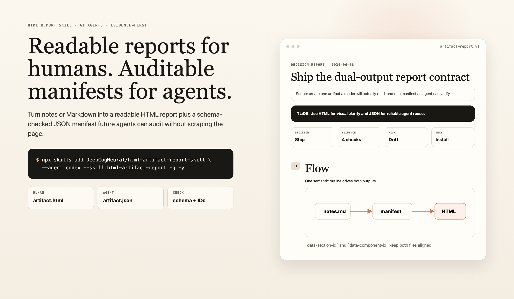

# HTML Report Skill for AI Agents

<p>
  <a href="README.md"><kbd>English</kbd></a>
  <a href="README.zh-CN.md"><kbd>简体中文</kbd></a>
  <a href="docs/i18n/es.md"><kbd>Español</kbd></a>
  <a href="docs/i18n/ja.md"><kbd>日本語</kbd></a>
  <a href="docs/i18n/fr.md"><kbd>Français</kbd></a>
</p>

[](https://github.com/DeepCogNeural/html-artifact-report-skill/actions/workflows/ci.yml)
[](LICENSE)
[](SPEC.md)

Turn notes or Markdown into a readable standalone HTML report plus a schema-checked JSON manifest.

Use it when an agent output is too important to leave as chat or a Markdown wall: decision briefs, technical reviews, research reports, incident writeups, strategy memos, and data-heavy summaries.

Why this exists: people need a report they will actually read; future agents need a manifest they can verify without scraping prose. `html-artifact-report` gives both outputs from one contract.

It is a portable skill for Claude Code, Codex, Cursor, Gemini CLI, DeepSeek-backed clients, and any file-reading coding agent:

- `artifact.html`: a warm editorial single-file report that people can read.
- `artifact.json`: a structured manifest that future agents can verify, diff, and reuse.
- Checker-enforced alignment: HTML `data-section-id` / `data-component-id` values must match the JSON contract.



## Why Agents Use It

Markdown is a good source format, but it is a poor final surface for substantial work. Pretty HTML alone is also not enough, because the next agent has to scrape and guess.

This skill keeps each format in its proper job. Markdown can be input. HTML is the reading surface. JSON is the agent interface. The manifest records sections, components, claims, evidence, source hashes, verification, and limitations.

The visual style is inspired by the broader HTML artifact workflow: answer first, warm editorial typography, dense but readable layouts, folded raw evidence, and diagrams/tables where they help. This is a clean-room implementation; no third-party templates, screenshots, CSS, or assets are copied.

## Install

Pick your agent and install only for that client.

Claude Code:

```bash
npx skills add DeepCogNeural/html-artifact-report-skill \
  --agent claude-code \
  --skill html-artifact-report \
  -g -y
```

Codex:

```bash
npx skills add DeepCogNeural/html-artifact-report-skill \
  --agent codex \
  --skill html-artifact-report \
  -g -y
```

Check that the skill is discoverable:

```bash
npx skills add DeepCogNeural/html-artifact-report-skill --list
```

Use without installing:

```bash
npx skills use DeepCogNeural/html-artifact-report-skill@html-artifact-report
```

## Agent Install Matrix

| Agent | Install | First prompt |
| --- | --- | --- |
| Claude Code | `npx skills add DeepCogNeural/html-artifact-report-skill --agent claude-code --skill html-artifact-report -g -y` | `Use html-artifact-report. Turn notes.md into artifact.html and artifact.json. Run both checkers.` |
| Codex | `npx skills add DeepCogNeural/html-artifact-report-skill --agent codex --skill html-artifact-report -g -y` | `Use html-artifact-report. Read SPEC.md and one example first, then validate HTML/JSON alignment.` |
| Cursor | `npx skills add DeepCogNeural/html-artifact-report-skill --agent cursor --skill html-artifact-report -g -y` | `Use the repo skill instructions. Produce both files and do not treat JSON as a second essay.` |
| Gemini CLI | `npx skills add DeepCogNeural/html-artifact-report-skill --agent gemini-cli --skill html-artifact-report -g -y` | `Use this skill as a file-based workflow. Read SKILL.md, SPEC.md, and one example.` |
| DeepSeek-backed agents | Install through the client running DeepSeek, or paste the one-off prompt from `npx skills use`. | `Use DeepSeek as the model, but follow this repository's SKILL.md/SPEC.md contract.` |
| Any file-reading agent | Clone this repo and point the agent at `SKILL.md`. | `Follow SKILL.md exactly. Output artifact.html and artifact.json, then run the Python checkers.` |

Full setup guide: [docs/agents.md](docs/agents.md).

## Copy-Paste Quickstart

```text
Use the html-artifact-report skill.

Input: notes.md
Output:
- artifact.html
- artifact.json

Read these first:
- SKILL.md
- SPEC.md
- templates/desktop-report-template.html
- components/report-components.md
- one complete example under examples/

The JSON manifest is not a prose duplicate.
It must validate against contract/artifact-report.schema.json and align with
the HTML data-section-id / data-component-id values.

Run:
python3 scripts/check_html_artifact.py artifact.html
python3 scripts/check_artifact_json.py artifact.json --html artifact.html
```

## Examples Gallery

| Example | HTML | JSON | Use case |
| --- | --- | --- | --- |
| Executive decision brief | [artifact.html](examples/executive-decision-brief/artifact.html) | [artifact.json](examples/executive-decision-brief/artifact.json) | First-screen recommendation and decision evidence |
| Data-heavy report | [artifact.html](examples/data-heavy-report/artifact.html) | [artifact.json](examples/data-heavy-report/artifact.json) | Tables and raw evidence folded behind readable summaries |
| Technical design review | [artifact.html](examples/technical-design-review/artifact.html) | [artifact.json](examples/technical-design-review/artifact.json) | Architecture review with cross-checked IDs |
| CJK report | [artifact.html](examples/cjk-report/artifact.html) | [artifact.json](examples/cjk-report/artifact.json) | CJK prose with stable machine IDs |

Run the full validation suite:

```bash
python3 scripts/check_examples.py
python3 -m unittest discover -s tests
```

## Public Contract

Every completed report must include:

1. A standalone `artifact.html`.
2. A paired `artifact.json`.
3. `<meta name="artifact-contract" content="artifact-report.v1">` in HTML.
4. Matching IDs:
   - HTML sections use `data-section-id`.
   - HTML components use `data-component-id`.
   - JSON `sections[].id` and `components[].id` must match the HTML exactly.
5. Source hashes for local evidence files.
6. Verification and limitations in both the manifest and the visible report.

Required JSON fields:

```text
schema_version, artifact_id, title, template_version, source_hashes,
sections, components, claims, evidence, verification, limitations
```

## Checker-Enforced Rules

- Canonical warm editorial profile: single 1180px column, serif headings, warm palette.
- Answer-first TL;DR and summary cards.
- At least one meaningful visual or table.
- Folded raw evidence, not giant default visible tables.
- Visible verification and limitations.
- No default sidebar TOC, tab-hidden main content, purple gradients, GitHub-dark shell, or generic AI slop.
- JSON schema validity.
- Duplicate ID detection on both HTML and JSON.
- Bidirectional HTML/JSON section and component alignment.
- Source-hash checks for local evidence files.
- Negative fixtures proving bad/slop and drift cases fail.

## Agent Discoverability

This repo is built so agents can find the contract without crawling everything:

- [AGENTS.md](AGENTS.md): repository instructions for coding agents.
- [llms.txt](llms.txt): short curated agent map.
- [docs/agents.md](docs/agents.md): installation and first-run prompts.
- [SKILL.md](SKILL.md): runtime skill instructions.
- [SPEC.md](SPEC.md): public artifact contract.
- `examples/*/artifact.{html,json}`: golden examples for forward testing.

Recommended GitHub topics:

```text
ai-agents, agent-skill, claude-code, codex, cursor, gemini-cli,
deepseek, llm, html-report, json-schema, documentation, evidence
```

## Multilingual Quickstarts

- [简体中文](README.zh-CN.md)
- [Español](docs/i18n/es.md)
- [日本語](docs/i18n/ja.md)
- [Français](docs/i18n/fr.md)

## What This Is Not

- Not a website builder.
- Not a Markdown-to-HTML converter.
- Not a GUI app.
- Not a template marketplace.
- Not a replacement for human visual review before publishing.

The point is not to make every possible page. The point is to make one kind of report reliably excellent.

## Prior Art

This is a clean-room implementation inspired by:

- [haidang1810/md2html](https://github.com/haidang1810/md2html): semantic component mapping for agent-generated HTML.
- [alchaincyf/huashu-md-html](https://github.com/alchaincyf/huashu-md-html): Markdown as source, HTML as polished artifact, explicit anti-slop rules.
- [nexu-io/html-anything](https://github.com/nexu-io/html-anything): skill metadata, examples, and local agent artifact thinking.
- [Claude Code HTML artifact workflow](https://claude.com/blog/using-claude-code-the-unreasonable-effectiveness-of-html): HTML as a richer, more readable output surface for complex agent work.

No third-party code, templates, screenshots, or assets are copied in v1. See [ATTRIBUTIONS.md](ATTRIBUTIONS.md).

## Repository Layout

```text
.
├── AGENTS.md
├── SKILL.md
├── SPEC.md
├── llms.txt
├── contract/
├── templates/
├── components/
├── references/
├── examples/
├── docs/
├── scripts/
└── tests/
```

## Contributing

Keep the scope tight. v1 is a report skill, not an app. See [CONTRIBUTING.md](CONTRIBUTING.md).

## License

MIT. Generated artifacts may include template HTML/CSS from this repository; see [LICENSE](LICENSE) and [SPEC.md](SPEC.md#generated-artifact-license-note).
