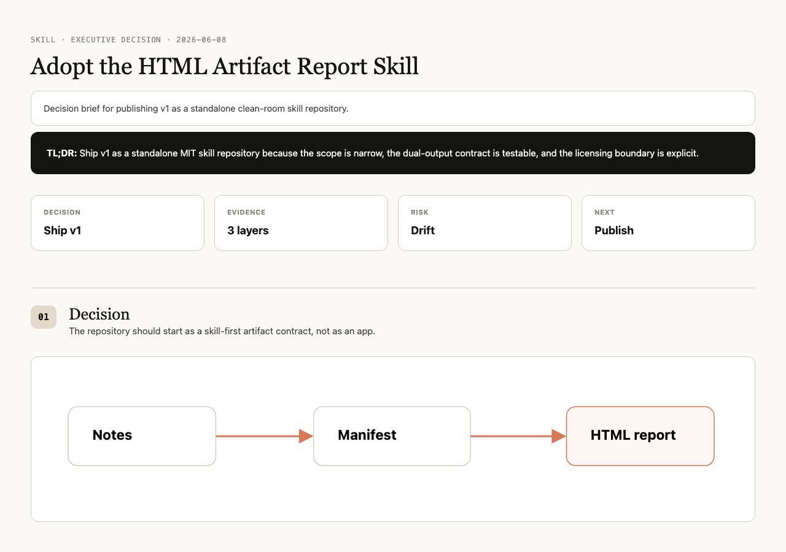

# HTML Artifact Report Skill

[](https://github.com/DeepCogNeural/html-artifact-report-skill/actions/workflows/ci.yml)
[](LICENSE)
[](SPEC.md)

Turn serious agent work into two aligned artifacts:

- `artifact.html` — a warm editorial report that humans can actually read.
- `artifact.json` — a machine-readable manifest that agents can audit, diff, and reuse.

Markdown is a good source format. HTML is a better reading surface. JSON is a better agent interface. This skill keeps all three in their proper jobs.



## Why this exists

Most agent reports fail in one of two ways:

1. They are Markdown walls that are easy for agents to emit but tiring for people to read.
2. They are pretty HTML pages that humans like, but future agents must scrape and guess.

This repository solves that with a strict dual-output contract. The human report and the agent manifest must describe the same sections, components, claims, evidence, source hashes, verification status, and limitations.

## Install

For Codex-style local skills:

```bash
git clone https://github.com/DeepCogNeural/html-artifact-report-skill.git
ln -s "$PWD/html-artifact-report-skill" ~/.codex/skills/html-artifact-report
```

For any coding agent, point it at `SKILL.md` and ask it to read `SPEC.md` before writing an artifact.

## Agent quickstart

Copy this into your coding agent:

```text
Use the html-artifact-report skill.

Input: notes.md
Output:
- artifact.html
- artifact.json

Read SPEC.md, templates/desktop-report-template.html, components/report-components.md,
and one complete example first. The JSON manifest is not a prose duplicate.
It must validate against contract/artifact-report.schema.json and align with
the HTML data-section-id / data-component-id values.

Run:
python3 scripts/check_html_artifact.py artifact.html
python3 scripts/check_artifact_json.py artifact.json --html artifact.html
```

## Human quickstart

Inspect the examples:

| Example | What it demonstrates |
| --- | --- |
| [`executive-decision-brief`](examples/executive-decision-brief/) | A compact decision memo with a first-screen answer |
| [`data-heavy-report`](examples/data-heavy-report/) | Tables folded behind evidence while summary stays readable |
| [`technical-design-review`](examples/technical-design-review/) | HTML/JSON ID alignment for a design review |
| [`cjk-report`](examples/cjk-report/) | CJK prose with stable machine IDs |

Run the checks:

```bash
python3 scripts/check_examples.py
python3 -m unittest discover -s tests
```

## The contract

Every completed report must include:

1. A standalone `artifact.html`.
2. A paired `artifact.json`.
3. `<meta name="artifact-contract" content="artifact-report.v1">` in HTML.
4. Matching IDs:
   - HTML sections use `data-section-id`.
   - HTML components use `data-component-id`.
   - JSON `sections[].id` and `components[].id` must match the HTML exactly.
5. Source hashes for local evidence files.
6. Verification and limitations in both the manifest and the visible report.

The manifest is for agents. It records structure and evidence, not another long essay.

## What the checker enforces

- Canonical warm editorial profile: single 1180px column, serif headings, warm palette.
- Answer-first TL;DR and summary cards.
- Folded raw evidence.
- Verification and limitations.
- No default sidebar TOC, tab-hidden main content, purple gradients, GitHub-dark shell, or generic AI slop.
- JSON schema validity.
- Duplicate ID detection on both HTML and JSON.
- Bidirectional HTML/JSON section and component alignment.
- Source-hash checks for local evidence files.
- Negative fixtures that prove bad/slop and drift cases fail.

## What this is not

- Not a website builder.
- Not a Markdown-to-HTML converter.
- Not a GUI app.
- Not a template marketplace.
- Not a replacement for human visual review before publishing.

## Agent discoverability

This repo includes:

- [`AGENTS.md`](AGENTS.md) for coding agents entering the repository.
- [`llms.txt`](llms.txt) as a concise agent-readable map.
- Stable examples under `examples/*/artifact.{html,json}`.
- A small test surface with no runtime package dependency.

Recommended GitHub topics:

```text
ai-agents, agent-skill, codex, llm, html-report, json-schema,
markdown, documentation, evidence, artifact
```

## Design principles

The visual profile is intentionally narrow:

- Warm editorial single-file HTML.
- One wide main column.
- Human first-screen answer.
- Evidence summarized before raw detail.
- Raw material folded, not hidden.
- Machine-readable manifest instead of HTML scraping.

The point is not to make every possible page. The point is to make one kind of report reliably excellent.

## Prior art

This is a clean-room implementation inspired by:

- [`haidang1810/md2html`](https://github.com/haidang1810/md2html) — semantic component mapping for agent-generated HTML.
- [`alchaincyf/huashu-md-html`](https://github.com/alchaincyf/huashu-md-html) — Markdown as source, HTML as polished artifact, explicit anti-slop rules.
- [`nexu-io/html-anything`](https://github.com/nexu-io/html-anything) — skill metadata, examples, and local agent artifact thinking.

No third-party code, templates, screenshots, or assets are copied in v1. See [`ATTRIBUTIONS.md`](ATTRIBUTIONS.md).

## Repository layout

```text
.
├── AGENTS.md
├── SKILL.md
├── SPEC.md
├── llms.txt
├── contract/
├── templates/
├── components/
├── references/
├── examples/
├── scripts/
└── tests/
```

## Contributing

Keep the scope tight. v1 is a report skill, not an app. See [`CONTRIBUTING.md`](CONTRIBUTING.md).

## License

MIT. Generated artifacts may include template HTML/CSS from this repository; see [`LICENSE`](LICENSE) and [`SPEC.md`](SPEC.md#generated-artifact-license-note).

